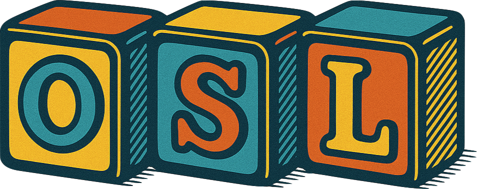

<div align="center">


</div>

# Optimal System for Learning (OSL)

**A research-backed, AI-assisted learning system that transforms how you read, retain, and transfer knowledge.**

OSL isn't just another study method—it's a complete learning operating system built on decades of cognitive science research. By combining proven techniques like retrieval practice, spaced repetition, and the generation effect with carefully bounded AI assistance, OSL helps you build lasting knowledge while preserving the cognitive work that makes learning stick.

## 🎯 What Makes OSL Different

### Research-First Design
Every feature in OSL is grounded in peer-reviewed research:
- **Testing Effect** (Roediger & Karpicke, 2006): Active recall beats passive review by 50%
- **Generation Effect** (Slamecka & Graf, 1978): Self-created materials are remembered better
- **Spacing Effect** (Ebbinghaus, 1885): Distributed practice creates durable memories
- **Interleaving** (Rohrer, 2012): Mixed practice enhances discrimination and transfer

### Learner Sovereignty 
OSL preserves your cognitive ownership:
- **You** identify what's important (metacognition)
- **You** write all learning materials (generation effect)
- **You** make connections between ideas (elaboration)
- AI assists only after your attempts, never replaces your thinking

### Adaptive Governance
Smart guardrails that prevent overwhelm while maintaining flexibility:
- Calibration gates ensure quality before quantity (75-85% retrieval threshold)
- Card debt caps prevent review backlog (1.5-2.5× daily capacity)
- Session limits maintain sustainable pace (4-10 new cards)
- All thresholds are tunable to your needs

## 🚀 The OSL Learning Flow

### 1. Micro-Loop Reading Cycles
**The heart of OSL: Active processing every 5-10 pages**

```
Question → Read → Retrieve → Explain → Feedback
```

- Pick 1-3 guiding questions before reading
- Read with focused attention (5-10 pages for technical, 3-5 for dense material)
- Free recall for 1-2 minutes (preserved verbatim)
- Write Feynman explanation in 3-5 sentences
- Receive AI-generated questions AFTER your attempt
- Immediate corrective feedback enhances retention

### 2. Learner-Authored Flashcards
**You create every card—this is non-negotiable**

- Identify your own knowledge gaps
- Decide what's worth remembering
- Write questions and answers in your words
- Limited to ≤8 cards per session (forces prioritization)
- AI only helps with formatting, never generates content

### 3. Permanent Notes & Synthesis
**Building your knowledge network**

- Write claims in your own words
- Identify when concepts apply/fail
- Create concrete examples
- Link to related ideas (you choose connections)
- Weekly synthesis essays integrate concepts
- Concept maps visualize relationships (5-minute limit)

### 4. Spaced & Interleaved Practice
**Optimized review scheduling**

- Reviews at expanding intervals: 1d → 3d → 7d → 14d → monthly
- Mix topics 1-3× per week for better discrimination
- Calibration quizzes test and adjust confidence
- Transfer projects apply knowledge to real artifacts

## 📊 Implementation Status

### ✅ Core Philosophy & Specifications
- Complete learning methodology (V3_Core)
- AI boundary enforcement (prevents learning destruction)
- Flashcard philosophy (protects generation effect)
- Governance standards with adaptive thresholds
- State management schemas (Version 3.0)

### 🤖 Claude Code Integration
OSL leverages Claude Code as its intelligent interface, providing natural language interaction while maintaining deterministic learning outcomes:

**Slash Commands** - Quick workflow triggers:
- `/osl-start [book]` - Initialize new book/topic
- `/osl-session` - Manage reading sessions  
- `/osl-review` - Retrieval practice with governance checks
- `/osl-synthesis` - Weekly integration and connections
- `/osl-project` - Monthly transfer projects
- `/osl-calibrate` - Confidence assessment
- `/osl-interleave` - Mixed practice sessions

**AI Subagents** - Specialized learning roles:
- `osl-tutor` - Generates questions AFTER your free recall
- `osl-extractor` - Creates cited outlines (no paraphrasing)
- `osl-coach` - Manages schedule and governance
- `osl-synthesizer` - Helps identify cross-topic connections
- `osl-quiz-master` - Adaptive quiz generation

**Automation Hooks** - Seamless workflow:
- Session tracking without manual logging
- Automatic governance gate checking
- State persistence across sessions
- Git commits after learning milestones

### 🔧 CLI Tool (The Engine)
The OSL CLI is the deterministic core that powers all operations. Claude Code commands are thin wrappers that translate natural language to CLI calls:

```bash
# Core CLI commands (called by Claude Code)
osl init                    # Initialize learning environment
osl session start/end        # Manage learning sessions
osl microloop complete       # Track real-time progress
osl flashcard create         # Learner-authored cards only
osl governance check         # Monitor learning health
osl state show              # View current metrics

# Learning activity commands (preserve cognition)
osl questions add           # Track curiosity questions
osl misconception add       # Identify learning errors
osl flashcard create        # Author your own cards

# Administrative commands (can be automated)
osl metrics calculate       # Compute retrieval rates
osl state update           # Modify governance status
osl context get            # Retrieve AI context
```

The CLI ensures all calculations, state management, and validation happen deterministically, while Claude Code provides the natural interaction layer.

## 🏗️ System Architecture

```
osl/
├── docs/                   # Complete OSL specifications
│   ├── V3_Core.md         # The methodology
│   ├── OSL_AI_Boundaries.md    # Critical timing rules
│   ├── OSL_Flashcard_Philosophy.md  # Generation effect
│   └── OSL_Governance_Standards.md  # Adaptive thresholds
├── obsidian/              # Your knowledge vault
│   ├── 10_books/          # Per-book workspaces
│   ├── 20_synthesis/      # Weekly essays
│   └── 30_projects/       # Transfer artifacts
├── anki/                  # Spaced repetition system
├── ai_state/              # Session continuity
│   ├── coach_state.json   # Central governance
│   └── current_session.json  # Real-time tracking
└── osl-cli/               # Command-line interface
```

## 🎓 Core Learning Principles

### 1. Retrieval Practice First
- Free recall before any assistance
- Testing effect amplifies retention
- Immediate feedback after attempts

### 2. Generation Over Consumption
- You author all learning materials
- Personal relevance drives memory
- Choosing what to learn IS learning

### 3. Spacing & Interleaving
- Reviews at optimal intervals
- Mixed practice prevents interference
- Transfer through varied contexts

### 4. Metacognitive Awareness
- Track curiosity questions
- Identify misconceptions
- Calibrate confidence vs. performance

### 5. Bounded AI Assistance
- AI enhances, never replaces
- Timing preserves effortful retrieval
- Clear boundaries protect learning

## 🚦 Getting Started

### Prerequisites
- **Claude Code**: The AI-powered terminal interface that powers OSL
- **Obsidian**: For note-taking and knowledge management
- **Anki**: For spaced repetition (with AnkiConnect addon)
- **Python 3.8+**: For the OSL CLI tool
- **Git**: For version control of your learning

### Quick Setup

1. **Clone and Initialize**
```bash
git clone <repository>
cd osl
pip install -e osl-cli/
osl init
```

2. **Configure Claude Code Integration**
```bash
# OSL provides Claude Code commands and subagents
# The .claude/ folder contains:
# - commands/     # Slash commands (/osl-*)
# - agents/       # AI subagents (tutor, coach, etc.)
# - hooks/        # Automation scripts
# - output-styles/ # Learning modes
# - settings.json # Configuration

# Install to your home directory:
cp -r .claude ~/

# Or symlink for updates:
ln -s $(pwd)/.claude ~/.claude
```

3. **Configure Obsidian**
- Open Obsidian
- Select "Open folder as vault"
- Navigate to `osl/obsidian/`

4. **Setup Anki**
- Install [AnkiConnect](https://ankiweb.net/shared/info/2055492159) (code: 2055492159)
- Create deck named "OSL::Current"
- Enable FSRS scheduler

5. **Start Learning with Claude Code**
```bash
# In Claude Code terminal:
/osl-start "Deep Work"          # Initialize a new book
/osl-session start               # Begin reading session
# Read 5-10 pages, then...
/osl-session end                 # End with micro-loop tracking
/osl-review                      # Check due items
/osl-synthesis                   # Weekly integration
```

## 💻 Daily Workflow with Claude Code

### Morning Session (45 minutes)
```bash
# In Claude Code terminal
/osl-session start
# Claude checks governance gates, loads context

"I'm reading Deep Work chapter 3"
# Claude understands and tracks

# After reading 5-10 pages:
"Done with pages 45-55"
# Claude automatically invokes osl-tutor subagent

# Tutor guides micro-loop:
# 1. "Take 2 minutes for free recall..."
# 2. "Now explain the concept as if teaching..."
# 3. Generates 2-3 questions based on material
# 4. Provides immediate feedback

"I want to create a card about the 4-hour limit"
# You write the question and answer
# Claude helps with formatting only

/osl-session end
# Automatic metrics calculation and state update
```

### Natural Language Understanding
Claude Code understands natural variations:
- "Let's start" → `/osl-session start`
- "I'm done reading" → Triggers micro-loop
- "What should I review?" → `/osl-review`
- "Time for synthesis" → `/osl-synthesis`

### Proactive AI Assistance
The osl-tutor subagent activates automatically:
- After you complete free recall (never before)
- When you finish a reading chunk
- During weekly calibration sessions

### Governance Protection
Claude Code enforces OSL principles:
- Blocks new material if retrieval < 80%
- Limits cards to 8 per session (4 if struggling)
- Ensures you author all learning materials
- Preserves your exact words with hash verification

## 📚 Essential Documentation

### For Understanding OSL
- **[V3_Core.md](docs/V3_Core.md)** - Complete methodology and workflow
- **[OSL_Master_Reference_Guide.md](docs/OSL_Master_Reference_Guide.md)** - Document map and quick reference
- **[OSL_User_Interaction_Guide.md](docs/OSL_User_Interaction_Guide.md)** - How to actually use OSL

### Critical Specifications
- **[OSL_AI_Boundaries.md](docs/OSL_AI_Boundaries.md)** - When AI can and cannot assist
- **[OSL_Flashcard_Philosophy.md](docs/OSL_Flashcard_Philosophy.md)** - Why learner authorship is non-negotiable
- **[OSL_Governance_Standards.md](docs/OSL_Governance_Standards.md)** - Adaptive thresholds and tuning

### Implementation Details
- **[OSL_State_Schema.md](docs/OSL_State_Schema.md)** - Data structures and state management
- **[V3_Implementation_Guide.md](docs/V3_Implementation_Guide.md)** - Templates, tools, and setup

## 🔬 Research Foundation

OSL synthesizes findings from cognitive science into a practical system:

- **Roediger & Karpicke (2006)**: Testing effect - retrieval practice beats repeated study
- **Slamecka & Graf (1978)**: Generation effect - self-created materials enhance memory
- **Kornell & Bjork (2008)**: Interleaving - mixed practice improves discrimination
- **Dunlosky et al. (2013)**: Practice testing and distributed practice are most effective
- **Hattie & Timperley (2007)**: Immediate corrective feedback optimizes learning

## 🤝 Philosophy & Values

### What OSL Stands For
- **Learner Agency**: You control what and how you learn
- **Cognitive Ownership**: Your thinking can't be outsourced
- **Sustainable Practice**: Quality over quantity, always
- **Evidence-Based**: Every feature backed by research
- **Adaptive Structure**: Rigid enough to guide, flexible enough to fit

### What OSL Opposes
- AI-generated learning materials (destroys generation effect)
- Passive consumption without retrieval
- Overwhelming card debt and review backlogs
- One-size-fits-all learning approaches
- Feature creep without research backing

## 🛠️ Development

OSL follows a three-layer architecture ensuring reliable automation despite AI non-determinism:

### Architecture Layers
1. **CLI Tool Layer** (Deterministic Core)
   - All business logic, calculations, and state management
   - Single source of truth for OSL operations
   - Example: `osl metrics calculate --type retrieval --success 7 --total 8`

2. **Slash Command Layer** (Semi-Deterministic Interface)
   - Thin wrappers over CLI with validation
   - Maps natural language to CLI commands
   - Example: `/osl-session start` → `osl session start --book "current"`

3. **Natural Language Layer** (AI Understanding)
   - Claude interprets intent and routes to commands
   - Example: "I'm done reading" → micro-loop activation

### Implementation Status

#### Phase 1: Claude Code Foundation (In Progress)
- ✅ Core CLI tool with state management
- ✅ Session and micro-loop tracking
- ✅ Learner-authored flashcard system
- 🔄 Slash commands for all workflows
- 🔄 AI subagents (tutor, coach, extractor)
- 🔄 Automation hooks for seamless tracking

#### Phase 2: Advanced Features (Planned)
- Transfer project management
- Calibration and interleaving systems
- Misconception tracking and resolution
- Quiz generation with state machine

#### Phase 3: Integration Ecosystem (Future)
- Enhanced Obsidian integration
- Advanced AnkiConnect features
- Progress visualization dashboard
- Multi-device synchronization

## 📈 Metrics & Success

OSL tracks meaningful learning indicators:
- **Retrieval Rate**: 7-day rolling average (target: 75-85%)
- **Calibration Accuracy**: Prediction vs. actual performance
- **Transfer Velocity**: Time to first applied artifact
- **Misconception Resolution**: Errors identified and corrected
- **Sustainable Pace**: Card debt ratio and session consistency

## 🚨 Important Boundaries

### AI Can Only Assist AFTER You've Tried
- Questions come after free recall, not before
- Feedback enhances your attempts, doesn't replace them
- AI never generates your learning materials

### You Must Author All Learning Materials
- Every flashcard is your decision and your words
- Permanent notes reflect your understanding
- Synthesis essays are entirely your creation

### Governance Gates Protect Your Learning
- Calibration gate: Ensures understanding before progress
- Card debt cap: Prevents unsustainable backlog
- Session limits: Maintains quality over quantity

## 🌟 The OSL Promise

When you commit to OSL's process, you're not just reading books—you're building a permanent knowledge architecture. Every micro-loop strengthens retrieval pathways. Every self-authored flashcard deepens ownership. Every synthesis essay creates new connections.

OSL doesn't make learning easy—it makes learning effective. The inefficiency is the feature. The effort is the point. The struggle is where growth happens.

## 📬 Support & Community

- **Documentation**: See [docs/](docs/) for complete specifications
- **Issues**: Report bugs or request features via GitHub Issues
- **Contributing**: See [CONTRIBUTING.md](CONTRIBUTING.md) for guidelines
- **Research**: Citations and evidence in [docs/V3_Core.md](docs/V3_Core.md)

---

*OSL: Where cognitive science meets daily practice. Where AI enhances but never replaces. Where you own every bit of your learning.*

**Version 3.0** | **Schema 3.0** | **Built on Research, Not Opinions**