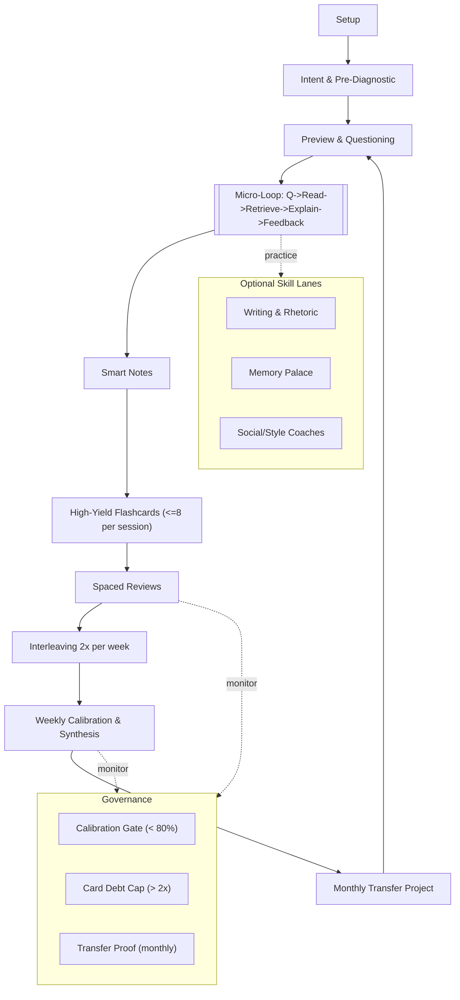
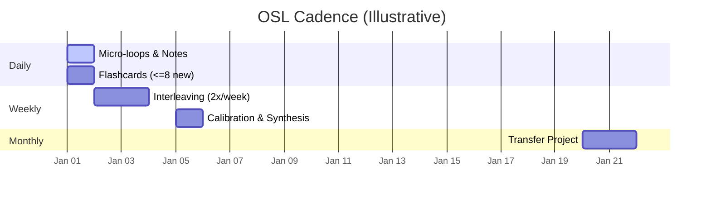
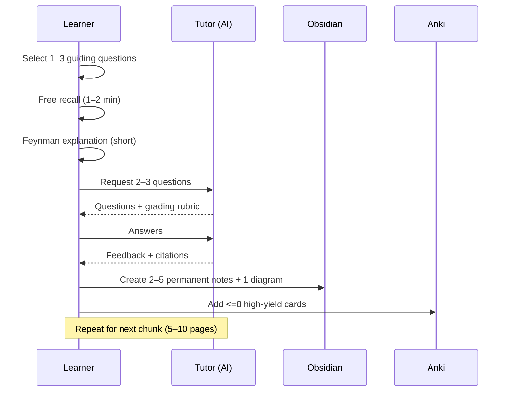

# Optimized System for Learning (OSL)
_A research-backed, AI-assisted reading and learning process for comprehension, retention, and transfer._

---

## 1. Core Principles
- **Retrieval practice**: Actively recall, don't just reread.  
- **Spacing**: Review at increasing intervals (1d → 3d → 7d → 14d → monthly).  
- **Interleaving**: Mix related topics to strengthen discrimination and transfer.  
- **Self-explanation**: Rephrase in your own words (Feynman style).  
- **Feedback**: Immediate correction strengthens memory and reduces drift.  
- **Calibration**: Predict performance, test, and compare prediction vs. outcome.  
- **Transfer**: Apply ideas through synthesis writing and projects.

---

## 2. Workflow Overview
1. **Setup** (tools + AI roles)  
2. **Intent & Pre-Diagnostic** (goals + baseline)  
3. **Preview & Questioning** (curiosity + guiding questions)  
4. **Micro-Loop Reading Cycle** (Q → Read → Retrieve → Explain → Feedback)  
5. **Smart Notes** (permanent notes + diagrams)  
6. **High-Yield Flashcards** (≤8/session)  
7. **Spaced & Interleaved Practice** (scheduled reviews + mixed tasks)  
8. **Weekly Calibration & Synthesis** (test + essay)  
9. **Monthly Transfer Project** (applied artifact)  
10. **Governance Rules** (caps + gates to prevent overload)  
11. **Optional Skill Lanes** (mentors for writing, rhetoric, memory, style)

### Visual Overview (Flowchart)



### Cadence & Scheduling (Gantt)



---

## 3. Setup
- **Tools**  
  - Notes: **Obsidian** (must capture citations).  
  - Flashcards: Anki (or similar, with spaced repetition).  
  - Diagrams: Excalidraw, Whimsical.  
- **AI Roles**  
  - **Extractor**: Provides _cited bullet points and outlines only_ (no free summaries without references).  
  - **Tutor**: Runs Socratic Q&A, grades responses (Accuracy 0–2, Reasoning 0–2, Evidence 0–1), and gives corrective feedback.  
  - **Coach**: Maintains spaced review schedule, interleaving plan, and enforces caps.  

### Obsidian Implementation (required)
- **Vault structure (suggested):**
  - `00_inbox/` (quick captures)
  - `10_books/<Book Title>/` → `notes/permanent/`, `notes/literature/`, `diagrams/`, `tests/`, `artifacts/`, `book.md`
  - `20_synthesis/` (weekly essays)
  - `30_projects_transfer/` (monthly artifacts)
  - `90_templates/` (note + card templates)
- **Frontmatter (copy/paste):**

  ```yaml
  ---
  type: permanent | literature | session | synthesis | artifact
  source:
    title: ""
    author: ""
    edition: ""
    page: ""
    location: ""
  tags: [book/slug, concept/slug]
  links: []
  ---
  ```

- **Permanent note skeleton:**
  - Claim (own words) • Applies / Fails • Example • Citation • Links
- **Session log (daily):** date, pages covered, predicted score, actual score, misconceptions added, `#cards_created`.
- **Concept map:** rough Excalidraw saved in `10_books/<Book>/diagrams/` and linked from `book.md`.
- **Citation format:** `Author, *Title* (Year), ch X, p. Y` _or_ Kindle location. Keep consistent.

### Anki Implementation (required)
- **Decks:** `OSL::<Book>` (per book) _or_ `OSL::Domain::<Topic>`; choose one scheme and stick with it.
- **Note types:**
  - **Cloze (with source)** — fields: `Text`, `Source`, `WhenToUse`, `Tags`.
  - **Basic (Application)** — fields: `Scenario`, `Answer`, `Source`, `Tags`.
- **Tagging:** `book/<slug>`, `concept/<slug>`, `type/cloze|application`, `status/high-yield`.
- **Daily limits:** New ≤ **8**; set Reviews to a level that stays comfortable (e.g., 60–150/day depending on time).
- **Scheduler:** Use Anki's default (SM‑2/FSRS). Treat 1d/3d/7d/14d as **target windows**, not exact intervals.
- **Leeches:** Set leech threshold (e.g., 8) to suspend or rewrite. Bury related new cards.
- **Creation rule:** Add cards primarily from **misses** in quizzes or from high‑yield discriminations/applications.
- **Recommended scheduling settings (Anki 2.1.60+):**  
  - Enable **V3 scheduler** and **FSRS** (Preferences → Scheduling).  
  - **Bury siblings** on the same day.  
  - Set **Maximum interval** to match horizon (e.g., 365–730 days).  
  - **Leech action:** suspend & tag (e.g., `leech`).  
  - **Learning steps:** e.g., `10m 1d` for Basic; keep Cloze defaults unless you have trouble.  
  - **Review order:** Due order **oldest first** when catching up.
- **Throughput planning:** Define _normal daily throughput_ as the **7‑day average of reviews actually completed**. Governance rules use this to compute the card‑debt cap.

## 4. Intent & Pre-Diagnostic (10–20 min)
- Write **3 outcomes** (e.g., "Explain X to a novice and an expert," "Solve Y problem type," "Apply Z to project A").  
- Run a **6–10 item baseline quiz** (mix recall, application, transfer).  
- Create a **1-page concept map** of what you already know.  
- Identify initial **misconceptions** or unknown terms.  

---

## 5. Preview & Questioning (15–25 min)
- Skim table of contents, headings, diagrams.  
- Write **5 curiosity questions** in your own words.  
- Convert **headings → guiding questions** for each section.  
- (Optional) Ask **Extractor** to build a _cited outline_ for structural clarity.

---

## 6. Micro-Loop Reading Cycle (repeat for 5–10 Pages or One scene/chapter)
1. **Question**: Select 1–3 guiding questions.  
2. **Read**: Focused chunk, minimal highlights (claims, data, examples).  
3. **Retrieve**: Free recall for 1–2 minutes on a blank page.  
4. **Explain**: Write or speak a short Feynman explanation (define, example, contrast, limitation).  
5. **Feedback**: Tutor generates 2–3 questions; grade & correct mistakes immediately.

#### Micro-Loop (Sequence Diagram)



---

## 7. Smart Notes (end of Each Session, 8–12 min)
- Write **2–5 permanent notes**:  
  - Claim/idea (in own words)  
  - When it applies / when it fails  
  - Example or application  
  - Citation (book, page/loc)  
  - Links to related notes  
- Create **1 diagram or dual-coded visual** if structure matters.  

---

## 8. High-Yield Flashcards (5–10 Min, ≤8/session)
- Use cloze deletions, discriminations (X vs. Y), and "when/why" prompts.  
- Prioritize **application cards** (scenarios) over simple definitions.  
- Every card must include **citation/source**.  
- Add new cards only if review load allows (see Governance).  

---

## 9. Spaced & Interleaved Practice
- **Spacing Schedule**: 1d → 3d → 7d → 14d → monthly.  
- **Daily reviews**: 10–15 min Anki.  
- **Interleaving sessions (2×/week, 20–30 min)**: Mix  
  - Current chapter/topic  
  - Prior chapters  
  - Adjacent or cross-domain material  

---

## 10. Weekly Calibration & Synthesis (60–90 min)
- **Prediction → Test → Feedback**: Predict score, take a 20–25 min timed quiz, compare results.  
- Update **misconception list**; schedule targeted reviews.  
- Write a **1-page synthesis essay** integrating 2–3 concepts into a coherent perspective.  

---

## 11. Monthly Transfer Project (2–4 hrs)
- Build or apply knowledge:  
  - Create a tutorial, lesson, critique, or worked example set.  
  - For literature: thematic analysis or close-read portfolio.  
  - For STEM: problem set with derivations + error catalog.  
- Publish artifact to notes hub for reference.

---

## 12. Governance Rules
- **Calibration Gate:** If weekly retrieval < **80%**, **pause new content**. Run one remediation loop:
  1) Review misses (flashcards + notes)  
  2) Re‑explain hardest ideas (self‑explanation)  
  3) Re‑test (10–12 min timed) → resume only if ≥80%.
- **Card Debt Cap:** If due cards > **2×** your normal daily throughput _(7‑day average reviews completed)_, **halt new card creation**. Consolidate: merge redundant cards, convert defs → discriminations, suspend leeches.
- **Transfer Proof:** Each month produce one artifact (tutorial, critique, worked examples, close‑read portfolio) and file it under `30_projects_transfer/`.
- **Coach duties:** The Coach enforces these gates and schedules catch‑up blocks (e.g., 2 × 20‑min review sessions before allowing new material).

## 13. Optional Skill Lanes (add if Goals require)
- **Writing & Rhetoric**: Progymnasmata exercises 2–3×/week (15–30 min).  
- **Memory Palace**: Weekly 20‑min session for memorizing ordered material (lists, speeches, names).  
- **Social/Style Coaches**: Short (10–20 min) sessions on communication or writing style.  
- These are optional add‑ons, not part of the core OSL loop.

## 14. Genre Adjustments
- **STEM/Technical**: Derive key formulas, maintain an error catalog, interleave problem types.  
- **History/Social Science**: Map claims → evidence → uncertainty; steel-man counterarguments.  
- **Literature**: After each scene/chapter, ask "Who wants what? What changed?" + close-read passages.  
- **Lists/Names**: Use method of loci for sequence-heavy material.

---

## 15. Session Templates
**Daily (≈45 min):**  
- 5m plan → 25m micro-loops → 10m flashcards → 5m notes wrap-up  

**Weekly (≈90 min):**  
- 15m prediction → 25m timed test → 20m feedback/fix → 25m synthesis essay → 5m planning  

**Monthly (2–3 hrs):**  
- Select project → build artifact → critique (peer/AI) → publish  

---

## 16. Metrics to Track
- Retrieval % correct (per test)  
- Prediction error (confidence vs. score)  
- # misconceptions closed  
- Flashcard load (new/day, due/day)  
- Time to first application/project  

---

## 17. Templates (copy/paste)
**Permanent Note (Obsidian)**

```markdown
---
type: permanent
source: {title: "", author: "", edition: "", page: "", location: ""}
tags: [book/slug, concept/slug]
---
# <Concept – one‑line hook>
**Claim (own words):** …
**Applies when:** …  
**Fails when:** …  
**Example/Application:** …  
**Citation:** Author, *Title* (Year), ch X, p. Y  
**Links:** [[related‑note‑1]], [[related‑note‑2]]
```

**Session Log (Obsidian)**

```markdown
---
type: session
book: ""
date: YYYY‑MM‑DD
pages: "" # or locations
---
Prediction::  
Timed test score::  
Missed Qs → fixes::  
Misconceptions added::  
New cards created::  
```markdown
---
type: session
book: ""
date: YYYY‑MM‑DD
pages: "" # or locations
---
**Plan:** …  
**Prediction (score %):** …  
**Timed test score (%):** …  
**Missed Qs → fixes:** …  
**Misconceptions added:** …  
**New cards created:** N (≤8)
```

**Weekly Synthesis (Obsidian)**

```markdown
---
type: synthesis
week: YYYY‑WW
---
Focus::  
Key ideas integrated::  
Application next week::  
References::  
```markdown
---
type: synthesis
week: YYYY‑WW
---
**Prompt:** Weave 2–3 concepts into a coherent perspective with one concrete application next week.  
**Draft:** …  
**References:** …
```

**Anki – Cloze with Source**
- **Text:** `… {{c1::key idea}} …`; include a contrast or condition when possible.  
- **Source:** `Author – Title (Year), ch/page or loc`  
- **WhenToUse:** short context of application  
- **Tags:** `book/<slug> concept/<slug> type/cloze`

**Anki – Application Card**
- **Scenario (Front):** realistic prompt requiring application/decision  
- **Answer (Back):** steps/decision + brief why  
- **Source:** citation  
- **Tags:** `book/<slug> concept/<slug> type/application`

---

## 18. AI Role Prompts (ready to use)
**Extractor**
> Using only the supplied pages/quotes, produce a bullet outline with **verbatim citations** (book, chapter, page/location). No uncited paraphrases. Add a dependency map of concepts.

**Tutor**
> Act as a Socratic tutor. For the topic below, ask 2–3 questions that progress from recall → application → transfer. Grade each answer on **Accuracy (0–2), Reasoning (0–2), Evidence (0–1)** and give corrective feedback with a cited reference. If an answer is weak, ask a targeted follow‑up.

**Coach**
> Maintain my OSL cadence. Enforce: new cards/session ≤ 8; weekly retrieval ≥ 80%; due cards ≤ 2× daily throughput. Schedule spaced reviews (1d/3d/7d/14d/monthly) and **interleaving blocks twice per week** mixing current, prior, and adjacent topics. When gates trigger, prescribe a catch‑up plan.

---

## 19. Dashboards & Automations (Obsidian Dataview)
**Weekly Dashboard**

```dataview
TABLE date, book, pages, Prediction as "Pred %", "Timed test score" as Score, "New cards created" as New
FROM "10_books"
WHERE type = "session" AND date >= date(today) - dur(7 days)
SORT date DESC
```

**Weekly Metrics (roll-ups)**

```dataview
TABLE round(avg(number(Score)),1) as "Avg Test %", round(avg(number(Prediction)),1) as "Avg Pred %", sum(number("New cards created")) as "New Cards"
FROM "10_books"
WHERE type = "session" AND date >= date(today) - dur(7 days)
```

**Synthesis Queue**

```dataview
LIST FROM "20_synthesis" WHERE week >= dateformat(date(today) - dur(7 days), "yyyy-'W'ww")
```

> Tip: Use the **Periodic Notes** plugin to auto-create weekly pages that embed the above blocks.

---

## 20. Rubrics & Quality Bars
**Weekly Synthesis Rubric (score ✓/✗)**
- Integrates ≥2 ideas accurately  
- Provides 1 concrete application for next week  
- Cites sources (chapter/page or loc)  
- Clear stance or insight (not a recap)

**Monthly Transfer Project Rubric**
- Problem/goal defined and scoped  
- Uses ≥2 concepts from month's study  
- Evidence or worked examples included  
- Limitations/next steps noted  
- References linked

**Flashcard Quality Bar**
- One idea per card; unambiguous cue  
- Prefer discriminations/application over bare defs  
- Includes source  
- Passes "two‑way test" (front→back and back→front make sense)

---

## 21. Quiz Templates & Item Bank
**Baseline/Weekly Quiz Template (10 items)**
- Recall (3): definitions, key claims, formula names  
- Application (4): short scenarios, choose method/step  
- Transfer (3): novel context, compare/contrast or decide

**Item Stems (examples)**
- _Recall:_ "State the assumptions behind …"  
- _Application:_ "Given X, which procedure would you use and why?"  
- _Transfer:_ "Apply concept A to domain B; what changes?"

---

# Summary
The OSL process is a **practical, research-backed framework** for AI-assisted learning.  
It combines **PQ4R structure**, **testing + spacing as the engine**, **interleaving for transfer**, **self-explanation for comprehension**, and **governance rules to prevent overload**.  
Optional "skill lanes" allow learners to build rhetoric, writing, memory, and style without disrupting the core workflow.  

This playbook is designed to be **sustainable, flexible, and highly effective** across technical, non-fiction, and literary domains.
