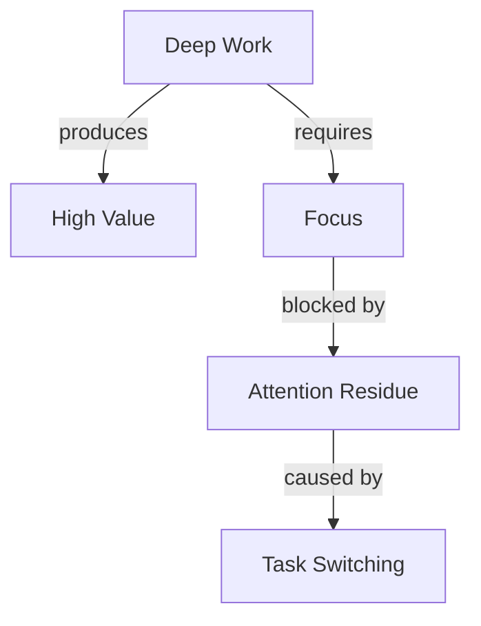

# OSL Concept Map Implementation
_Weekly visual synthesis in ≤5 minutes_

## Purpose: See the Forest, Not Just Trees

Concept maps reveal connections between ideas that linear notes miss. They're created AFTER learning, during weekly synthesis, when you have enough knowledge to see patterns.

## Core Constraints

### Timing: Weekly Synthesis Only
- **When**: End of week, after quiz
- **Why**: Need sufficient concepts to connect
- **Not**: Before reading (no knowledge yet)
- **Not**: Daily (too granular)

### Duration: ≤5 Minutes
- **Why**: Prevent over-engineering
- **Focus**: Major connections only
- **Not**: Comprehensive diagram
- **Not**: Detailed documentation

### Creation: Learner-Driven
- **You decide**: What connects to what
- **You identify**: Central concepts
- **You draw**: Relationship types
- **AI cannot**: Generate connections for you

## Implementation Options

### Option 1: Paper & Photo (Simplest)
```
1. Grab paper and pen
2. Set 5-minute timer
3. Draw concepts as nodes
4. Draw connections as lines
5. Label key relationships
6. Photo → Save to obsidian/10_books/[book]/diagrams/week_3_map.jpg
```

**Advantages**: Fast, tactile, no tools needed
**Storage**: Image file linked from weekly synthesis

### Option 2: Digital Whiteboard (Flexible)
```
Tools: Excalidraw, Whimsical, Draw.io, Miro
Format: Freeform visual
Export: PNG or PDF
Location: obsidian/10_books/[book]/diagrams/
```

**Example Structure**:
```
    [Deep Work] ←────── requires ────→ [Focus]
         ↓                                ↓
     produces                         blocked by
         ↓                                ↓
    [High Value]                  [Attention Residue]
         ↓                                ↑
     leads to                         caused by
         ↓                                ↑
    [Career Capital] ←───── reduced by ───→ [Task Switching]
```

### Option 3: Markdown ASCII (Portable)
```markdown
# Week 3 Concept Map

```
Deep Work
    ├── requires → Focused Attention
    ├── produces → High-Value Output
    └── builds → Career Capital
        
Attention Residue
    ├── caused by → Task Switching
    ├── blocks → Deep Work
    └── reduced by → Time Blocking

Flow State
    ├── differs from → Deep Work
    ├── optimal for → Performance
    └── requires → Clear Goals
```
```

**Advantages**: Version control, searchable, no tools
**Limitations**: Less visual, harder for complex relationships

### Option 4: Structured Data (Programmatic)
```json
{
  "concept_map": {
    "week": 3,
    "book": "Deep Work",
    "central_concept": "Deep Work",
    "nodes": [
      {"id": 1, "concept": "Deep Work"},
      {"id": 2, "concept": "Attention Residue"},
      {"id": 3, "concept": "Flow State"},
      {"id": 4, "concept": "Career Capital"}
    ],
    "edges": [
      {"from": 1, "to": 2, "relationship": "blocked_by"},
      {"from": 1, "to": 4, "relationship": "builds"},
      {"from": 3, "to": 1, "relationship": "differs_from"}
    ]
  }
}
```

**Advantages**: Can generate visualizations, queryable
**Use case**: When you want to analyze patterns over time

## What to Include

### Core Elements (Must Have)
- **3-7 major concepts** from the week
- **Key relationships** between them
- **One central concept** as anchor

### Optional Additions (If Time)
- Relationship labels (causes, enables, blocks)
- Example annotations (small text)
- Question marks for uncertainties

### What NOT to Include
- Every concept from the week
- Detailed explanations
- Perfect organization
- Color coding systems
- Elaborate legends

## The 5-Minute Process

### Minute 1: Brain Dump
Write/draw all major concepts from week

### Minute 2-3: Find Center
Identify most important concept
Place it centrally

### Minute 3-4: Draw Connections
Connect related concepts with lines
Add relationship labels if obvious

### Minute 5: Step Back
Look for missing major connections
Add question marks for uncertainties

**STOP at 5 minutes** - Perfection is not the goal

## Integration with Weekly Synthesis

### Workflow Position
```
1. Complete weekly quiz
2. Review week's permanent notes
3. **CREATE CONCEPT MAP** (5 min)
4. Write synthesis essay
5. Update coach state
```

### How Map Informs Essay
- Map reveals themes → Essay topics
- Connections suggest insights
- Gaps show what to explore
- Questions guide next week

### Storage and Linking
```markdown
# Weekly Synthesis - Week 3

## Concept Map
![[week_3_concept_map.png]]

## Key Insights
Based on the map, three patterns emerge:
1. Deep work and flow are distinct but complementary
2. Attention residue is the hidden productivity killer
3. Time blocking solves multiple problems simultaneously

[Essay continues...]
```

## Common Patterns to Look For

### Hub and Spoke
One concept connects to many others
→ Indicates fundamental principle

### Chains
A leads to B leads to C leads to D
→ Indicates process or progression

### Cycles
A affects B which affects C which affects A
→ Indicates feedback loops

### Islands
Concepts with no connections
→ Indicates incomplete understanding or separate domains

## Digital Tool Recommendations

### For Speed: Excalidraw
- Built into Obsidian
- Minimal interface
- Quick sketching
- Auto-save

### For Beauty: Whimsical
- Pretty defaults
- Easy sharing
- Template library
- Export options

### For Analysis: Mermaid


### For Simplicity: Paper
- No setup
- No decisions
- Natural drawing
- Photo when done

## What Success Looks Like

### Good Concept Map
✅ Created in 5 minutes
✅ Shows YOUR understanding
✅ Identifies 2-3 key relationships
✅ Raises 1-2 questions
✅ Helps write synthesis

### Over-Engineered Map
❌ Took 30 minutes
❌ Perfect layout
❌ Every concept included
❌ Complex color system
❌ No new insights

## CLI Integration

```bash
# Timer and reminder
osl synthesis map --start
# Starts 5-minute timer
# Shows: "Draw major concepts and connections"

osl synthesis map --complete
# Prompts for storage location
# Links to weekly synthesis
```

## The Key Insight

The concept map is a **thinking tool**, not a deliverable. Its value is in the creation process - helping you see connections you might miss in linear notes.

**Ugly maps that reveal insights > Beautiful maps that just document**

## Quick Decision Tree

```
Need to create concept map?
├─ Is it end of week? → Yes → Create map
├─ Have 3+ concepts? → Yes → Create map
├─ Want to see patterns? → Yes → Create map
└─ Otherwise → Skip this week
```

## Remember

- 5 minutes maximum
- Your connections, not AI's
- Messy is fine
- Questions are valuable
- It's a tool for YOUR thinking

The map that helps you write a better synthesis essay has done its job, regardless of how it looks.