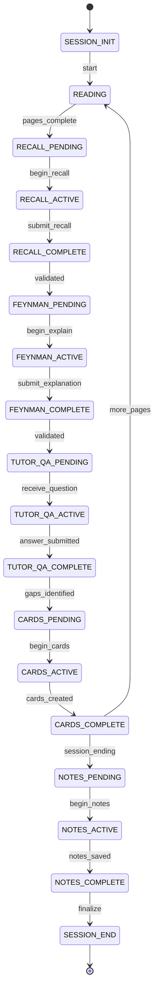

# OSL Validation Framework
_Enforcing workflow integrity and verbatim input preservation_

---

## Core Validation Principles

1. **Workflow State Machine**: No skipping or reordering steps
2. **Verbatim Preservation**: Human inputs stored exactly as typed
3. **Transition Guards**: Each step validates prerequisites
4. **Audit Trail**: Complete history of all inputs and transitions

---

## Workflow State Machine

### Valid States and Transitions



### State Validation Rules

```python
# osl/state_machine.py
class OSLStateMachine:
    """Enforces valid OSL workflow transitions"""
    
    VALID_TRANSITIONS = {
        'SESSION_INIT': ['READING'],
        'READING': ['RECALL_PENDING'],
        'RECALL_PENDING': ['RECALL_ACTIVE'],
        'RECALL_ACTIVE': ['RECALL_COMPLETE'],
        'RECALL_COMPLETE': ['FEYNMAN_PENDING'],
        'FEYNMAN_PENDING': ['FEYNMAN_ACTIVE'],
        'FEYNMAN_ACTIVE': ['FEYNMAN_COMPLETE'],
        'FEYNMAN_COMPLETE': ['TUTOR_QA_PENDING'],
        'TUTOR_QA_PENDING': ['TUTOR_QA_ACTIVE'],
        'TUTOR_QA_ACTIVE': ['TUTOR_QA_COMPLETE'],
        'TUTOR_QA_COMPLETE': ['CARDS_PENDING'],
        'CARDS_PENDING': ['CARDS_ACTIVE'],
        'CARDS_ACTIVE': ['CARDS_COMPLETE'],
        'CARDS_COMPLETE': ['READING', 'NOTES_PENDING'],
        'NOTES_PENDING': ['NOTES_ACTIVE'],
        'NOTES_ACTIVE': ['NOTES_COMPLETE'],
        'NOTES_COMPLETE': ['SESSION_END']
    }
    
    REQUIRED_INPUTS = {
        'RECALL_COMPLETE': ['recall_text', 'duration_seconds'],
        'FEYNMAN_COMPLETE': ['explanation_text'],
        'TUTOR_QA_COMPLETE': ['answers', 'confidence_ratings'],
        'CARDS_COMPLETE': ['cards_created', 'from_misses'],
        'NOTES_COMPLETE': ['permanent_notes']
    }
    
    def validate_transition(self, from_state, to_state, context=None):
        """Validate state transition is allowed"""
        if to_state not in self.VALID_TRANSITIONS.get(from_state, []):
            return {
                'valid': False,
                'error': f'Invalid transition: {from_state} -> {to_state}',
                'allowed': self.VALID_TRANSITIONS.get(from_state, []),
                'suggestion': f'Complete {from_state} activities first'
            }
        
        # Check required inputs for completion states
        if to_state.endswith('_COMPLETE'):
            required = self.REQUIRED_INPUTS.get(to_state, [])
            missing = [r for r in required if not context.get(r)]
            if missing:
                return {
                    'valid': False,
                    'error': f'Missing required inputs: {missing}',
                    'suggestion': f'Provide {missing} before completing'
                }
        
        return {'valid': True}
```

---

## Verbatim Input Preservation

### Storage Architecture

```json
// ai_state/session_inputs/{session_id}.json
{
  "session_id": "20250129_143022",
  "inputs": {
    "recall_1": {
      "timestamp": "2025-01-29T14:35:00Z",
      "raw_text": "The main concept was deep work, which Newport defines as focused cognitive effort on demanding tasks without distraction. Three key points:\n- Requires uninterrupted time blocks\n- Produces high-value output\n- Increasingly rare and valuable skill",
      "hash": "sha256:a3f2b8c9d4e5...",
      "preserved": true,
      "state": "RECALL_ACTIVE"
    },
    "feynman_1": {
      "timestamp": "2025-01-29T14:37:00Z",
      "raw_text": "Deep work is like being in a bubble where only you and the hard problem exist. No phones, no emails, just pure thinking. It's valuable because computers can't do this yet.",
      "hash": "sha256:b7c8d9e0f1a2...",
      "preserved": true,
      "state": "FEYNMAN_ACTIVE"
    }
  }
}
```

### Preservation Mechanism

```python
# osl/input_preservation.py
import hashlib
import json
from datetime import datetime

class InputPreserver:
    """Ensures verbatim preservation of user inputs"""
    
    def __init__(self, session_id):
        self.session_id = session_id
        self.input_file = f'ai_state/session_inputs/{session_id}.json'
        self.inputs = self.load_inputs()
    
    def preserve_input(self, input_type, raw_text, state):
        """Store user input verbatim with hash verification"""
        
        # Generate hash for integrity check
        text_hash = hashlib.sha256(raw_text.encode()).hexdigest()
        
        # Store with metadata
        input_id = f"{input_type}_{len(self.inputs) + 1}"
        self.inputs[input_id] = {
            'timestamp': datetime.now().isoformat(),
            'raw_text': raw_text,
            'hash': text_hash,
            'preserved': True,
            'state': state,
            'modified': False  # Flag if AI ever modifies
        }
        
        # Save immediately (atomic write)
        self.save_inputs()
        
        return {
            'input_id': input_id,
            'hash': text_hash,
            'preserved': True
        }
    
    def verify_preservation(self, input_id, text_to_verify):
        """Verify text matches original input exactly"""
        original = self.inputs.get(input_id, {})
        original_hash = original.get('hash')
        
        if not original_hash:
            return {'valid': False, 'error': 'Input not found'}
        
        verify_hash = hashlib.sha256(text_to_verify.encode()).hexdigest()
        
        if verify_hash != original_hash:
            # Mark as modified if doesn't match
            self.inputs[input_id]['modified'] = True
            self.save_inputs()
            
            return {
                'valid': False,
                'error': 'Input has been modified',
                'original_hash': original_hash,
                'current_hash': verify_hash,
                'suggestion': 'Use original text verbatim'
            }
        
        return {'valid': True, 'hash': original_hash}
```

---

## Claude Hooks for Validation

### Pre-Write Validation Hook

**Location:** `.claude/hooks/osl-validate-write.sh`

```bash
#!/bin/bash
# Validates that learning content is preserved verbatim before writing

# Check if this is a learning content write
if [[ "$1" == *"obsidian/"* ]] || [[ "$1" == *"ai_state/"* ]]; then
    # Extract content being written
    CONTENT="$2"
    
    # Call validation script
    python3 osl/validate_content.py \
        --action "pre-write" \
        --file "$1" \
        --content "$CONTENT" \
        --session "$(cat .osl_session_id)"
    
    RESULT=$?
    
    if [ $RESULT -ne 0 ]; then
        echo "❌ Validation failed: Content must be preserved verbatim"
        echo "💡 Use 'osl input get --id recall_1' to retrieve original text"
        exit 1
    fi
fi
```

### State Transition Hook

**Location:** `.claude/hooks/osl-validate-state.sh`

```bash
#!/bin/bash
# Validates state transitions are allowed

# Intercept OSL commands
if [[ "$1" == "osl "* ]]; then
    # Extract command
    CMD=$(echo "$1" | awk '{print $2}')
    
    # Check if transition is valid
    python3 osl/validate_transition.py \
        --command "$CMD" \
        --session "$(cat .osl_session_id)"
    
    RESULT=$?
    
    if [ $RESULT -ne 0 ]; then
        # Get current state and next valid actions
        CURRENT=$(osl state current)
        VALID=$(osl state next-actions)
        
        echo "❌ Invalid action for current state: $CURRENT"
        echo "✅ Valid actions: $VALID"
        exit 1
    fi
fi
```

### Content Verification Python Script

```python
#!/usr/bin/env python3
# osl/validate_content.py
"""Validates content preservation for Claude hooks"""

import argparse
import json
import sys
from pathlib import Path

def validate_content(action, file_path, content, session_id):
    """Validate content is preserved verbatim"""
    
    # Load session inputs
    input_file = f'ai_state/session_inputs/{session_id}.json'
    if not Path(input_file).exists():
        return True  # No inputs to validate against
    
    with open(input_file) as f:
        session_inputs = json.load(f)
    
    # Check if content contains user input
    for input_id, input_data in session_inputs['inputs'].items():
        raw_text = input_data['raw_text']
        
        # Check for AI modification patterns
        modification_patterns = [
            ('paraphrased:', 'summarized:', 'in other words:'),
            ('The user said:', 'They mentioned:', 'According to:'),
            ('approximately', 'roughly', 'about'),
        ]
        
        # If original text should be in content
        if any(keyword in file_path for keyword in ['recall', 'feynman', 'notes']):
            if raw_text in content:
                # Found verbatim - good!
                continue
            elif any(part in content for part in raw_text.split('\n')[:3]):
                # Partial match - might be modified
                print(f"WARNING: Potential modification detected")
                print(f"Original: {raw_text[:100]}...")
                print(f"Current: {content[:100]}...")
                return False
    
    return True

if __name__ == '__main__':
    parser = argparse.ArgumentParser()
    parser.add_argument('--action', required=True)
    parser.add_argument('--file', required=True)
    parser.add_argument('--content', required=True)
    parser.add_argument('--session', required=True)
    
    args = parser.parse_args()
    
    if not validate_content(args.action, args.file, args.content, args.session):
        sys.exit(1)
    
    sys.exit(0)
```

---

## CLI Enforcement Layer

### Session State Tracking

```python
# osl/cli_commands.py additions
class OSLCli:
    def __init__(self):
        self.state_machine = OSLStateMachine()
        self.input_preserver = None
        self.current_state = None
        
    def cmd_recall_start(self, args):
        """Start recall phase - validates state first"""
        
        # Load current state
        session_state = self.load_session_state()
        current = session_state.get('current_state')
        
        # Validate transition
        validation = self.state_machine.validate_transition(
            current, 'RECALL_ACTIVE'
        )
        
        if not validation['valid']:
            self.error_with_suggestion(
                validation['error'],
                validation.get('suggestion')
            )
        
        # Transition is valid - proceed
        session_state['current_state'] = 'RECALL_ACTIVE'
        session_state['recall_start'] = datetime.now().isoformat()
        self.save_session_state(session_state)
        
        return self.success_response({
            'status': 'Recall phase started',
            'instructions': 'Write everything you remember. Type "done" when finished.',
            'timer': 'Running (2 min suggested)'
        })
    
    def cmd_recall_submit(self, args):
        """Submit recall text - preserves verbatim"""
        
        # Validate state
        session_state = self.load_session_state()
        if session_state.get('current_state') != 'RECALL_ACTIVE':
            self.error_with_suggestion(
                'Cannot submit recall - not in recall phase',
                'Run: osl recall start'
            )
        
        # Preserve input verbatim
        preserver = InputPreserver(session_state['session_id'])
        preservation = preserver.preserve_input(
            'recall',
            args.text,  # RAW text from user
            'RECALL_ACTIVE'
        )
        
        # Store reference, not the text
        session_state['current_recall'] = preservation['input_id']
        session_state['current_state'] = 'RECALL_COMPLETE'
        self.save_session_state(session_state)
        
        return self.success_response({
            'status': 'Recall saved verbatim',
            'input_id': preservation['input_id'],
            'hash': preservation['hash'],
            'next_step': 'Feynman explanation'
        })
```

### Validation Configuration

```yaml
# osl_config.yaml additions
validation:
  enforce_state_machine: true
  preserve_verbatim: true
  allow_step_skipping: false
  require_prerequisites: true
  
  state_timeouts:
    RECALL_ACTIVE: 300  # 5 minutes max
    FEYNMAN_ACTIVE: 300
    TUTOR_QA_ACTIVE: 600  # 10 minutes for Q&A
    
  minimum_requirements:
    recall_words: 50
    feynman_sentences: 3
    cards_from_misses: 0.6  # 60% must be from gaps
    
  verbatim_preservation:
    hash_algorithm: sha256
    store_originals: true
    prevent_modification: true
    audit_changes: true
```

---

## Slash Command Validation

### Enforcing Verbatim in Commands

```markdown
# .claude/commands/osl-recall.md
---
allowed-tools: Bash(osl:*), Write
argument-hint: submit
description: Submit recall text verbatim
---

## CRITICAL: Verbatim Preservation Required

When user provides recall text, you MUST:
1. Pass it EXACTLY as typed to the CLI
2. Do NOT summarize, paraphrase, or clean up
3. Include all typos, formatting, everything

## Your Task

Capture user's recall text:

```bash
# Store exactly as provided
osl recall submit --text "$USER_TEXT_VERBATIM"
```

If you modify the text in ANY way, the system will reject it.

Examples of FORBIDDEN modifications:
- ❌ Fixing spelling errors
- ❌ Adding punctuation
- ❌ Reformatting bullets
- ❌ Summarizing content
- ❌ Adding "The user said:"
```

---

## State Query Commands

```bash
# User-facing state commands
osl state current          # What step am I on?
osl state next-actions     # What can I do now?
osl state progress         # How far through session?
osl state validate         # Check all requirements met

# Example outputs
$ osl state current
Current state: RECALL_COMPLETE
Completed: Reading (15 pages), Recall (127 words)
Ready for: Feynman explanation

$ osl state next-actions
Valid actions from RECALL_COMPLETE:
1. osl feynman start - Begin explanation phase
2. osl session pause - Save progress for later
3. osl help feynman - Learn about Feynman technique

$ osl state validate
✅ Pages read: 15 (minimum: 5)
✅ Recall submitted: 127 words (minimum: 50)
⏳ Feynman explanation: Pending
⏳ Tutor Q&A: Pending
⏳ Flashcards: Pending (0/8 created)
```

---

## Validation Reports

### Session Validation Summary

```json
// Generated at session end
{
  "session_id": "20250129_143022",
  "validation_report": {
    "workflow_compliance": {
      "valid_transitions": 12,
      "invalid_attempts": 0,
      "skipped_steps": []
    },
    "input_preservation": {
      "total_inputs": 8,
      "preserved_verbatim": 8,
      "modified_by_ai": 0,
      "hash_verifications": 8
    },
    "requirements_met": {
      "recall_words": "127/50 ✅",
      "feynman_explanation": "✅",
      "tutor_questions": "3/3 ✅",
      "cards_created": "5/8 ⚠️",
      "cards_from_misses": "4/5 (80%) ✅"
    },
    "time_compliance": {
      "recall_duration": "2:15 ✅",
      "total_session": "47:30 ✅"
    }
  }
}
```

---

## Error Recovery

### Invalid State Transition

```
User: "Create flashcards"
System: ❌ Cannot create flashcards yet

Current state: READING
Required sequence:
1. ✅ Reading (current)
2. ⏳ Recall
3. ⏳ Feynman explanation  
4. ⏳ Tutor Q&A
5. ⏳ THEN flashcards

Next valid action: Complete reading and start recall
Command: osl recall start
```

### Modified Input Detection

```
System: ❌ Input modification detected

You submitted: "The user recalled three main points about..."
Original started: "Three main points about..."

This appears to be AI paraphrasing. Please resubmit using:
osl input get --id recall_1 | osl recall submit --verbatim
```

---

## Testing Validation

```bash
# Test state machine
./test_state_machine.sh

# Test 1: Try to skip recall
osl feynman start  # Should fail
Expected: ERROR - Must complete recall first

# Test 2: Submit modified text
echo "Original text" | osl recall submit
echo "Modified text" | osl verify  # Should detect change

# Test 3: Valid flow
osl session start
osl reading complete --pages 10
osl recall start
echo "My recall text" | osl recall submit
osl feynman start
# ... continues validly
```

---

## Structured Parsing Integration

While maintaining verbatim preservation, the system supports structured parsing:

### Dual Storage Approach

```python
# 1. Always store raw input first
raw_id = preserver.preserve_input('flashcard_intent', user_text, state)

# 2. Parse using deterministic rules (not AI)
parsed = parser.parse(user_text)

# 3. Get user approval
if user.approves(parsed):
    # 4. Store parsed version with reference to raw
    store_parsed_item(parsed, raw_id)
```

### Key Principles

1. **Raw First**: Original input always preserved verbatim
2. **Deterministic Parsing**: CLI tool parses, not AI
3. **User Approval**: Show parsed version for confirmation
4. **Dual Storage**: Both raw and structured versions kept
5. **Source Links**: Parsed items reference their raw source

See [OSL Parsing Framework](OSL_Parsing_Framework.md) for full details.

## Summary

This validation framework ensures:

1. **No Step Skipping**: State machine enforces proper sequence
2. **Verbatim Preservation**: All human inputs stored exactly as typed
3. **Structured Parsing**: Deterministic extraction with approval
4. **Hash Verification**: Detects any AI modification
5. **Clear Error Messages**: Users know exactly what went wrong
6. **Audit Trail**: Complete record of all transitions and inputs

The system is now tamper-proof while remaining helpful and practical for structured learning content.