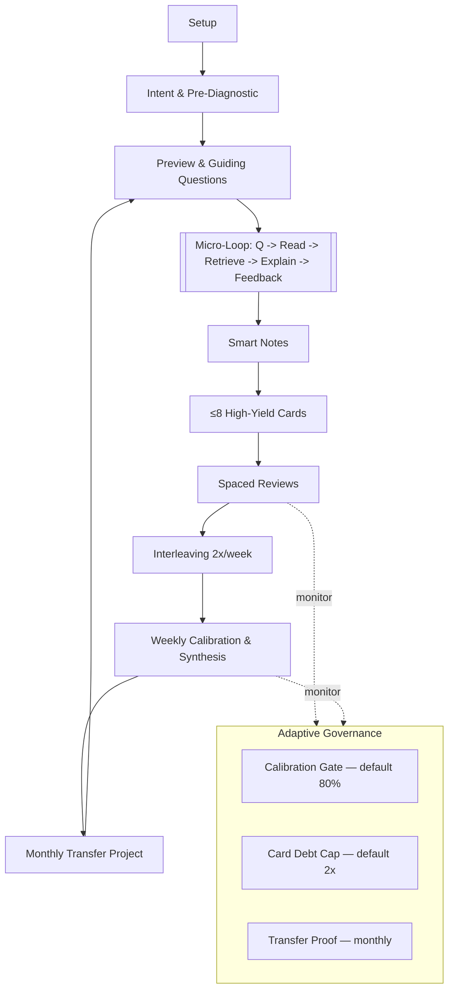
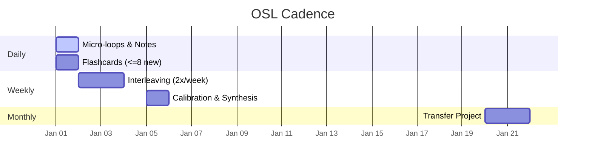
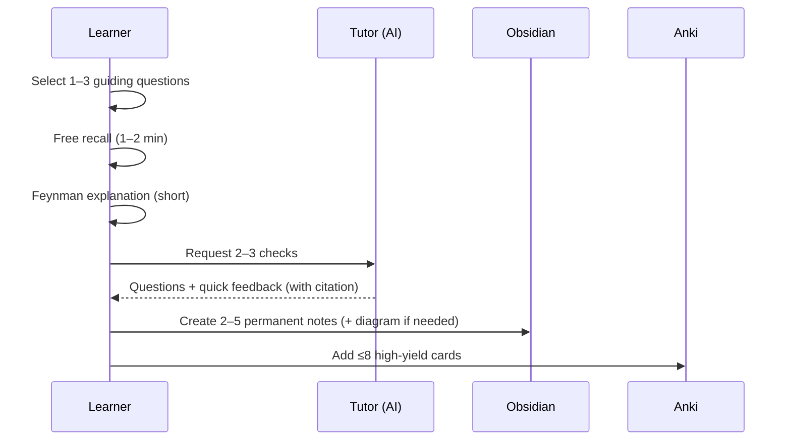

# OSL V3 — Implementation Guide (Tools, Templates & Diagrams)

_Companion to the V3 Core. Contains concrete setups, templates, visuals, dashboards, and tuning ranges._

> **Design intent:** Keep the **Core** lean while preserving all **useful, optional** implementation details here. Values are **defaults with tuning ranges**, not hard rules.

---

## A) Obsidian Implementation

### A1. Vault Structure (suggested)

```
# Located at: osl/obsidian/

00_inbox/ # Quick captures

10_books/<Book Title>/ # Per book workspace

book.md

notes/

permanent/

literature/

diagrams/

tests/

artifacts/

20_synthesis/ # Weekly essays

30_projects_transfer/ # Monthly artifacts

90_templates/ # Note & card templates

```

**Note:** With the Unified Folder Architecture (Section N), the Obsidian vault is located at `osl/obsidian/`. Point Obsidian to open this folder as your vault.

### A2. Frontmatter

```yaml

---

type: permanent | literature | session | synthesis | artifact

source:

title: ""

author: ""

edition: ""

page: ""

location: ""

tags: [book/slug, concept/slug]

links: []

---

```

### A3. Permanent Note Skeleton

- **Claim (own words)**
- **Applies when / Fails when**
- **Example or application**
- **Citation** (Author, _Title_ (Year), ch X, p. Y or Kindle loc)
- **Links** to related notes


### A4. Session Log

```markdown
---
type: session
book: ""
date: YYYY‑MM‑DD
pages: "" # or locations
---

**Plan:** …
**Prediction (score %):** …
**Timed test score (%):** …
**Missed Qs → fixes:** …
**Misconceptions added:** …
**New cards created:** N (≤8)
```

### A5. Concept Maps

- Use Excalidraw/Whimsical for a **weekly, ≤5-minute** concept map in `10_books/<Book>/diagrams/`.
- Update during **Weekly Synthesis**, not pre-reading.
- Link from `book.md` for discovery.

---

## B) Anki Implementation

**Note:** With the Unified Folder Architecture (Section N), Anki exports are stored in `osl/anki/exports/` for portability and version control.

### B1. Decking Schemes

- **Per book:** `OSL::<Book>`
- **Per domain:** `OSL::Domain::<Topic>`

Pick one approach and keep it consistent.


### B2. Note Types

**Cloze (with source)**

- Text: `… {{c1::key idea}} …` (prefer contrasts/conditions)
- Source: `Author – Title (Year), ch/page or loc`
- WhenToUse: short usage context
- Tags: `book/<slug> concept/<slug> type/cloze`


**Application Card**

- Scenario (Front): realistic prompt needing a decision/application
- Answer (Back): steps/decision + brief why
- Source + Tags as above


### B3. Tagging

`book/<slug>`, `concept/<slug>`, `type/cloze|application`, `status/high-yield`


### B4. Throughput & Limits

- **New cards/session:** ≤ **8** (default).
- **Daily reviews:** set to a comfortable ceiling (typical 60–150); **time guideline 10–15 minutes** (tune **8–20m** based on load).
- **Leeches:** threshold ~8 → suspend & tag `leech`; **rewrite later** (clearer prompt, better context, or convert to different card type).
- **Creation rule:** Create cards from **misses** or **high‑yield discriminations/applications**.


### B5. Scheduler Settings (Anki 2.1.60+)

- Enable **V3 scheduler** and **FSRS** (Preferences → Scheduling).
- **Bury siblings** for same-day exposure control.
- **Maximum interval** ≈ horizon (e.g., 365–730 days).
- **Learning steps**: e.g., `10m 1d` for Basic; keep Cloze defaults unless struggling.
- **Review order**: when catching up, use _due order oldest first_.


### B6. Card‑Debt Planning

Define **normal daily throughput** as the **7‑day average of reviews actually completed**. Governance uses this to compute caps.

---

## C) AI Roles (Prompts & Usage)

**Extractor**

> Using only the supplied pages/quotes, produce a bullet outline with **verbatim citations** (book, chapter, page/location). No uncited paraphrases. Add a minimal dependency map.


**Tutor (micro‑loop)**

> Ask 2–3 questions (recall → application → transfer). Provide brief corrective feedback with a citation. Avoid formal numeric grading during micro‑loops. Track missed concepts for card creation verification.

**Tutor (session wrap-up validation)**

> Review session outputs against these criteria:
> - Were flashcards created for all failed retrieval attempts? If not, flag specific gaps.
> - Do permanent notes follow claim→context→example→citation structure? Identify any missing elements.
> - Have previous session's misconceptions been addressed? List unresolved items.
> - Return a "completeness score" with specific action items.

**Tutor (weekly calibration)**

> For the quiz below, grade each answer with **Accuracy, Reasoning, Evidence**. Provide targeted corrections with citations and 1–2 follow‑ups on weak areas. Verify synthesis essay integrates ≥2 concepts with proper citations.


**Coach**

> Maintain OSL cadence. Defaults: new ≤ 8/session; weekly retrieval gate 80% (tune 75–85); card‑debt cap 2× throughput (tune 1.5×–2.5×). Schedule spaced reviews (1d/3d/7d/14d/monthly) and **interleaving blocks twice per week**. When gates trigger, prescribe catch‑up plans (e.g., **schedule 2 × 20‑minute review sessions before unlocking new material**) and unlock when stable. If desired, can trigger a **≤90s, 3-item recall probe** before a new book/module to activate prior knowledge—skip if it delays first micro-loops.

---

## D) Visuals (Mermaid)

### D1. Flowchart — Core Loop



### D2. Cadence (Illustrative Gantt)



### D3. Sequence — Micro‑Loop Details



---

## E) Dashboards & Automations (Obsidian Dataview)

**Weekly Dashboard**

```dataview

TABLE date, book, pages, Prediction as "Pred %", "Timed test score" as Score, "New cards created" as New

FROM "10_books"

WHERE type = "session" AND date >= date(today) - dur(7 days)

SORT date DESC

```

**Weekly Metrics (roll‑ups)**

```dataview

TABLE round(avg(number(Score)),1) as "Avg Test %", round(avg(number(Prediction)),1) as "Avg Pred %", sum(number("New cards created")) as "New Cards"

FROM "10_books"

WHERE type = "session" AND date >= date(today) - dur(7 days)

```

**Synthesis Queue**

```dataview

LIST FROM "20_synthesis" WHERE week >= dateformat(date(today) - dur(7 days), "yyyy-'W'ww")

```

---

## F) Rubrics & Quality Bars

**Weekly Synthesis (checklist)**

- Integrates ≥2 ideas accurately
- 1 concrete application for next week
- Cites sources (chapter/page or loc)
- Clear stance or insight (not a recap)


**Monthly Transfer Project**

- Problem/goal defined & scoped
- Uses ≥2 concepts from month
- Evidence/worked examples included
- Limits/next steps noted
- References linked


**Flashcard Quality Bar**

- One idea per card; unambiguous cue
- Prefer discriminations/application over bare defs
- Includes source
- Passes "two‑way test" (front→back and back→front make sense)

---

## G) Quizzes & Item Bank

**Weekly Quiz (6-10 items)**

- Recall (3) — definitions, key claims, formula names
- Application (3-4) — short scenarios, choose method/step
- Transfer (2-3) — novel context, compare/contrast or decide

**Optional Pre-Reading Probe (3 items, ≤90s)**

- Simple recall only — prerequisite concepts
- No application or transfer items
- Skip if no clear prerequisites


**Item Stems (examples)**

- **Recall:** "State the assumptions behind …"
- **Application:** "Given X, which procedure would you use and why?"
- **Transfer:** "Apply concept A to domain B; what changes?"

---

## H) Genre Appendices (optional)

- **STEM/Technical**: Maintain an **error catalog**; derive key formulas; interleave problem types.
- **History/Social Science**: Map **claims → evidence → uncertainty**; steel‑man counterarguments.
- **Literature**: After each scene/chapter, track **who wants what** and **what changed**; add close‑reads.
- **Lists/Names**: Use **method of loci** for sequence‑heavy material.

---

## I) Defaults & Tuning Ranges

- **Calibration Gate**: default **80%** (range **75–85**)
  - Use 75% for: beginners, difficult material, or when building confidence
  - Use 80% for: standard learning pace
  - Use 85% for: advanced learners or familiar domains requiring mastery

- **Card‑Debt Cap**: default **2×** throughput (range **1.5×–2.5×**)
  - Use 1.5× for: high stress periods, complex material, or when quality > quantity
  - Use 2× for: standard learning load
  - Use 2.5× for: catch-up periods or when comfortable with higher review loads

- **New Cards**: default **≤8** per session (range **4–10** based on comfort)
  - Use 4-6 for: dense technical material or when starting
  - Use 7-8 for: standard material complexity
  - Use 9-10 for: familiar domains or when review load is low

- **Interleaving**: **2×/week** (range **1–3×**); **session duration default 20–30 minutes**
  - Use 1×/week for: single-domain focus or time constraints
  - Use 2×/week for: standard transfer learning goals
  - Use 3×/week for: aggressive transfer or exam preparation

---

## J) Changelog — What Was Removed from V2 (and why)

- **Duplicate Session Log template** → **Removed** (confusing duplication; one authoritative template kept).
- **Per‑question numeric grading (Accuracy/Reasoning/Evidence) during micro‑loops** → **Removed from micro‑loops** (kept for **weekly** calibration to avoid bureaucratic friction while preserving rigor).
- **Rigid minute‑by‑minute schedules** → **Converted to guidelines** (maintain flexibility and sustainability).
- **Over‑assertive language** ("must/always") in tool sections → **Softened** to defaults + tuning ranges (prevents over‑engineering).


> Everything else from V2 that provides **critical or supplemental value** (Obsidian/Anki setup, diagrams, dashboards, rubrics, quiz templates, genre guidance) has been **preserved** here.

---

## K) Quick Start (Practical)

1) **Follow Section N setup**: Create the unified `osl/` folder structure, point Obsidian to `osl/obsidian/`.

2) **Copy templates** from Section A3-A5 to `osl/obsidian/90_templates/` and create your first **Session Log**.

3) Configure Anki FSRS; set new cards to **≤8**; pick your deck scheme; install AnkiConnect.

4) Start a reading session using the **Micro‑Loop**; end with notes + cards; export deck to `osl/anki/exports/`.

5) Schedule interleaving **twice this week** (target **20–30 minutes per session**); plan the **weekly quiz + synthesis**.

6) Add a **Transfer Project** idea to `osl/obsidian/30_projects_transfer/` for this month.

---

## L) Essential Operational Guidelines

### L1. Decision: No Kindle Highlighting Workflow

**Why OSL Explicitly Avoids Highlighting Systems:**

The OSL system intentionally does not incorporate Kindle highlighting or note-taking workflows, despite their popularity. This design decision prevents several anti-patterns:

1. **Highlighting Creates False Learning Signals**
   - Marking text feels productive but is passive consumption
   - Research shows highlighting has near-zero impact on retention
   - Time spent highlighting could be used for active retrieval

2. **Breaks Retrieval Practice Flow**
   - Going back to mark missed content interrupts the retrieve→explain→feedback cycle
   - The gap identification already happened during free recall
   - Re-reading to highlight provides no additional learning value

3. **Redundant with Superior Mechanisms**
   - Free recall already identifies knowledge gaps
   - Permanent notes capture insights with proper citations
   - Flashcards target specific weaknesses
   - Tutor feedback corrects misconceptions
   - Adding highlighting creates a sixth, inferior mechanism

4. **Enables Procrastination Patterns**
   - Learners often substitute highlighting for actual processing
   - "I'll process these highlights later" rarely happens
   - Creates a backlog of unprocessed marks that become cognitive debt

**The OSL Alternative:**
- Read with full attention (minimal or no marking)
- Immediately test understanding through retrieval
- Create permanent notes from memory + understanding
- Reference source only for citations during note creation

**Historical Note:** Earlier iterations considered "retrieval-informed highlighting" (marking only what was missed during recall) but testing showed this added complexity without improving outcomes. The time cost of returning to text negated any diagnostic value.

### L2. Curiosity Questions vs Guiding Questions

**Curiosity Questions (learner-generated, start of session):**
- Personal wonderings that anchor motivation
- Example: "How does this concept relate to [something I already know]?"
- Track in session notes; revisit at weekly synthesis
- If answered during reading, note the resolution

**Guiding Questions (converted from headings, per section):**
- Structural navigation for the micro-loop
- Example: Heading "Memory Consolidation" → "What mechanisms drive memory consolidation?"
- Use 1-3 per micro-loop cycle

### L2. Interleaving Patterns (2×/week sessions)

**Effective Mix (20-30 min session):**
- 40% current material (this week's content)
- 40% recent material (last 2-3 weeks)
- 20% distant/adjacent material (older or cross-domain)

**Example Session:**
- 8 min: Current chapter problems
- 8 min: Last week's synthesis concepts
- 4 min: Cross-domain application (e.g., apply psychology concept to programming)

### L3. Coach AI Memory Infrastructure

### Structured Session State Management

**Core State File (`ai_state/coach_state.json`):**

**Note:** With the Unified Folder Architecture (Section N), all AI state files are centralized in `osl/ai_state/`.

**Core State File:**
```json
{
  "last_updated": "YYYY-MM-DD HH:MM",
  "active_books": [
    {
      "title": "",
      "start_date": "",
      "current_page": 0,
      "total_pages": 0,
      "sessions_completed": 0,
      "avg_retrieval_score": 0
    }
  ],
  "review_schedule": {
    "next_interleaving": "YYYY-MM-DD",
    "next_calibration": "YYYY-MM-DD",
    "next_synthesis": "YYYY-MM-DD",
    "next_project": "YYYY-MM-DD"
  },
  "performance_metrics": {
    "7d_avg_retrieval": 0,
    "7d_avg_prediction_accuracy": 0,
    "current_card_debt_ratio": 0,
    "daily_review_throughput": 0
  },
  "governance_status": {
    "calibration_gate": "passing|failing",
    "card_debt_gate": "passing|failing",
    "transfer_gate": "passing|failing",
    "remediation_active": false
  }
}
```

**Session Log Enhancement (`ai_state/session_logs/YYYY-MM-DD_session.json`):**
```json
{
  "session_id": "YYYY-MM-DD-HH-MM",
  "book": "",
  "pages_read": "",
  "micro_loops_completed": 0,
  "retrieval_attempts": [
    {
      "chunk_pages": "X-Y",
      "recall_quality": "complete|partial|failed",
      "missed_concepts": []
    }
  ],
  "permanent_notes_created": [],
  "flashcards_created": {
    "count": 0,
    "from_misses": 0,
    "from_discriminations": 0
  },
  "test_results": {
    "prediction": 0,
    "actual": 0,
    "missed_items": []
  }
}
```

### Automation Scripts

**1. Post-Session State Updater (`scripts/update_coach_state.sh`):**
```bash
#!/bin/bash
# Run after each session to aggregate state
# Execute from osl/ root directory
python scripts/aggregate_session_data.py \
  --session-log "ai_state/session_logs/$(date +%Y-%m-%d)_session.json" \
  --update-state "ai_state/coach_state.json"
```

**2. Pre-Session Coach Briefing (`scripts/brief_coach.py`):**
```python
# Generates AI-readable context from state
# Execute from osl/ root directory
import json
from datetime import datetime, timedelta

def generate_coach_context():
    with open('ai_state/coach_state.json') as f:
        state = json.load(f)

    context = f"""
    Current Learning State:
    - Active books: {len(state['active_books'])}
    - 7-day retrieval average: {state['performance_metrics']['7d_avg_retrieval']}%
    - Card debt ratio: {state['performance_metrics']['current_card_debt_ratio']}x
    - Governance gates: {state['governance_status']}
    - Next scheduled events: {state['review_schedule']}
    """
    return context
```

### Coach AI Continuity Protocol

1. **Start of Session:**
   - Run `brief_coach.py` to generate context
   - Feed context to Coach AI as initial prompt
   - Coach reviews governance status and prescribes session focus

2. **During Session:**
   - Log all retrieval attempts and scores in structured format
   - Track card creation against limits
   - Update misconception list in real-time

3. **End of Session:**
   - Run `update_coach_state.sh` to aggregate data
   - Generate next session's schedule
   - Flag any governance violations for next session

4. **Weekly Maintenance:**
   - Archive old session logs to `ai_state/archive/YYYY-WW/`
   - Compute rolling averages
   - Prune completed books from active list

## L4. Error Recovery Protocols

**Multiple Gates Triggered:**
1. Stop all new material immediately
2. Run diagnostic: which gate is most critical? (usually calibration < 80%)
3. Address in order: Calibration → Card Debt → Transfer
4. Coach schedules focused remediation blocks

**Falling >1 Week Behind:**
1. Declare "catch-up week" - no new material
2. Reduce daily card load to 50% temporarily
3. Focus on highest-yield permanent notes only
4. Resume normal pace once caught up

**Unmanageable Card Debt (despite caps):**
1. Suspend bottom 30% cards by interval (newest/hardest)
2. Consolidate similar cards into discriminations
3. Convert definitions → applications where possible
4. Reset to sustainable load before continuing

---

## M) OSL Evolution Protocol: The Six-Gate Framework

### Purpose
Prevents feature creep and ritual accumulation by requiring all proposed additions or modifications to pass systematic evaluation. This framework maintains OSL's focus on evidence-based, high-ROI learning activities.

### The Six Gates for Core Inclusion

**Critical Gates (Must Pass):**

1. **First-Principles Alignment** [FATAL if failed]
   - Does it directly support one of OSL's eight core principles?
   - Retrieval, spacing, interleaving, self-explanation, feedback, calibration, transfer, or curiosity-driven questioning
   - If no → Cannot be in Core (may exist as optional)

2. **Unique Learning Signal** [FATAL if failed]
   - Does it generate learning value not captured by existing mechanisms?
   - Current pipeline: question → read → recall → explain → feedback → notes → cards
   - If fully redundant → Remove entirely

3. **Momentum Preservation** [FATAL if failed]
   - Does it maintain or enhance the micro-loop flow state?
   - Context switches, material reopening, or mid-loop interruptions fail this gate
   - If disruptive → Relocate to session boundaries or remove

**Important Gates (Strong Preference to Pass):**

4. **ROI Superiority**
   - Learning value per minute vs. next best alternative
   - Calculate: (Expected retention gain × Transfer probability) / Time cost
   - If inferior to running another micro-loop → Strongly consider removal

5. **Complexity-Value Ratio**
   - Does added complexity justify the learning benefit?
   - Consider: setup time, decision fatigue, tool overhead, maintenance burden
   - If complexity > value → Simplify radically or remove

**Validation Gate:**

6. **Empirical Support**
   - Is there research evidence OR clear mechanistic reasoning?
   - Can impact be observed through: retrieval scores, calibration accuracy, transfer quality, or sustained engagement?
   - If neither evidence nor clear mechanism → Test in optional lane first

### Decision Framework

**For Core Inclusion:**
- MUST pass all three Critical Gates (1-3)
- SHOULD pass both Important Gates (4-5)
- MUST have plan to validate Gate 6 within 30 days

**For Optional/Appendix Inclusion:**
- Must pass at least Gate 1 (First Principles)
- Must not actively harm the Core workflow
- Should provide value for specific use cases

**Edge Cases:**
- If something fails Gate 4 or 5 but provides overwhelming value elsewhere, document the tradeoff explicitly
- If something is beloved by users but fails gates, create an "Optional Variations" section
- If evidence is emerging but not conclusive (Gate 6), run as time-bounded experiment

### Sustainability Check
Even if passing all gates, ask: "Can a motivated learner maintain this for 3+ months without burnout?"
- If no → Simplify until sustainable
- If still no → Move to "Sprint Techniques" (intensive but time-limited use)

### Application Examples

**KEEP (Passes All Gates):**
- Micro-loops: Maximum retrieval practice, unique feedback loop, high momentum
- Weekly synthesis: Unique integration signal, measurable output
- Spaced reviews: Direct spacing implementation, proven by decades of research

**TUNE (Valuable but Needs Constraints):**
- Concept maps: Value for structure, but time-box to ≤5 minutes
- Interleaving: Keep core requirement but allow flexible implementation
- AI roles: Maintain clear boundaries to prevent over-reliance

**REMOVE (Fails Multiple Gates):**
- Kindle highlighting: Fails gates 2-5 (redundant, breaks momentum, poor ROI, adds overhead)
- Per-question grading in micro-loops: Cognitive overhead without unique value
- Duplicate templates: Pure overhead, no learning value

### Change Proposal Process

1. **Identify the proposed change** and which component it affects
2. **Run through all six gates** with specific evidence
3. **Document the evaluation** even if rejected (prevents re-litigation)
4. **If passing all gates**, run small test (1-2 weeks) before Core inclusion
5. **Archive decisions** with lessons learned

### Philosophy Conflicts Resolution

When user preferences conflict with OSL design:

**"But I learn better with X"** (where X fails gates):
- Acknowledge the preference
- Explain why X undermines OSL's mechanisms
- Offer the closest OSL-compatible alternative
- Document in "Common Misconceptions" if recurring

**"System Y does it this way"**:
- OSL is opinionated by design
- Not trying to accommodate all learning styles
- Optimized for evidence-based active recall
- Other systems may suit different goals

**"Can we make it configurable?"**:
- Configuration adds cognitive overhead (Gate 5)
- Creates support burden and decision fatigue
- Better to have one excellent path than many mediocre ones
- True variations go in Optional Lanes, not Core toggles

### Quick Evaluation Checklist

**Critical Gates (All must be YES for Core):**
- [ ] Directly supports one+ of the 8 core principles? (Gate 1)
- [ ] Creates unique learning value not already captured? (Gate 2)
- [ ] Preserves or enhances micro-loop momentum? (Gate 3)

**Important Gates (Should be YES):**
- [ ] Better ROI than another micro-loop? (Gate 4)
- [ ] Value exceeds complexity cost? (Gate 5)

**Validation Gate:**
- [ ] Has evidence OR clear mechanism OR test plan? (Gate 6)

**Sustainability:**
- [ ] Maintainable for 3+ months without burnout?

**Decision Tree:**
- 3 Critical = NO → Cannot be Core
- 3 Critical = YES, others mixed → May be Core with documentation
- Sustainability = NO → Must simplify or time-limit

### Historical Decisions Archive

All decisions evaluated through the Six-Gate Framework are documented in **[V3 Decision History.md](V3%20Decision%20History.md)**.

The archive contains:
- Complete gate-by-gate analysis of all proposed changes
- Clear documentation of what was accepted, rejected, or modified
- Lessons learned from each decision
- Emerging patterns and design philosophy

Consult the Decision History when:
- Proposing similar modifications
- Understanding why certain features exist (or don't)
- Preventing re-litigation of past decisions
- Onboarding new contributors to OSL development

---

## N) Unified OSL Folder Architecture

### Purpose
Consolidate all OSL-related files into a single, portable, version-controlled folder that serves as:
- Complete learning system repository (git-controlled)
- Obsidian vault root (via osl/obsidian/)
- Anki data exchange point (via AnkiConnect)
- AI memory and state management hub

### N1. Folder Structure

```
osl/                          # Root folder (git repository)
├── .git/                     # Git version control
├── .gitignore               # Version control exclusions
├── README.md                # Quick start and overview
├── osl_config.yaml          # Central configuration
│
├── docs/                    # Core documentation
│   ├── V3_Core.md
│   ├── V3_Implementation_Guide.md
│   └── V3_Decision_History.md
│
├── obsidian/                # Obsidian vault (point Obsidian here)
│   ├── .obsidian/          # Obsidian settings (partially gitignored)
│   ├── 00_inbox/           # Quick captures
│   ├── 10_books/           # Per-book workspaces
│   │   └── <Book_Title>/
│   │       ├── book.md
│   │       ├── notes/
│   │       │   ├── permanent/
│   │       │   └── literature/
│   │       ├── diagrams/
│   │       ├── tests/
│   │       └── artifacts/
│   ├── 20_synthesis/       # Weekly synthesis essays
│   ├── 30_projects_transfer/ # Monthly transfer projects
│   └── 90_templates/       # Note and card templates
│
├── anki/                    # Anki integration
│   ├── exports/            # .apkg deck exports (gitignored)
│   ├── media/              # Shared media files
│   ├── sync_log.json       # Track last sync times
│   └── deck_config.json    # Deck settings for import
│
├── ai_state/               # AI coaching and memory
│   ├── coach_state.json    # Current learning state
│   ├── session_logs/       # Individual session records
│   │   └── YYYY-MM-DD_session.json
│   ├── memory/             # AI context files
│   │   ├── project_context.md
│   │   └── learning_history.md
│   └── archive/            # Old session logs (gitignored)
│
├── scripts/                # Automation (examples/templates)
│   ├── update_coach_state.py
│   ├── brief_coach.py
│   └── examples/           # User-contributed scripts
│
└── config/                 # Additional configuration
    └── templates/          # Backup templates
```

### N2. Initial Setup

**1. Create Folder Structure:**
```bash
# Create root and main directories
mkdir -p osl/{docs,obsidian,anki,ai_state,scripts,config}
mkdir -p osl/obsidian/{00_inbox,10_books,20_synthesis,30_projects_transfer,90_templates}
mkdir -p osl/anki/{exports,media}
mkdir -p osl/ai_state/{session_logs,memory,archive}
mkdir -p osl/scripts/examples
mkdir -p osl/config/templates

# Copy documentation
cp "V3 Core.md" osl/docs/V3_Core.md
cp "V3 Implementation Guide.md" osl/docs/V3_Implementation_Guide.md

# Initialize git
cd osl
git init
```

**2. Configure Obsidian:**
- Open Obsidian → "Open folder as vault"
- Navigate to `osl/obsidian/`
- Obsidian will create `.obsidian/` config folder automatically
- Copy note templates from Section A (A3-A5) to `osl/obsidian/90_templates/`

**3. Configure Anki Integration:**
- Install AnkiConnect add-on (code: 2055492159)
- Configure AnkiConnect permissions:
  - Tools → Add-ons → AnkiConnect → Config
  - Ensure `"webCorsOriginList": ["http://localhost"]` is set
  - Set `"apiKey": null` for local-only access
- Use File → Export to save decks to `osl/anki/exports/`
- Use File → Import to load decks from exports

### N3. Configuration Files

**osl_config.yaml** (root directory):
```yaml
# OSL Configuration
version: "3.0"
paths:
  obsidian_vault: "./obsidian"
  anki_exports: "./anki/exports"
  ai_state: "./ai_state"
  session_logs: "./ai_state/session_logs"
  
anki:
  profile: "OSL_User"  # Your Anki profile name
  export_format: "apkg"
  include_scheduling: false  # For portability
  
ai:
  coach_state_file: "./ai_state/coach_state.json"
  memory_dir: "./ai_state/memory"
  
obsidian:
  daily_notes_folder: "00_inbox"
  templates_folder: "90_templates"
  
governance:
  calibration_gate: 80  # Percent threshold
  card_debt_multiplier: 2.0
  max_new_cards_per_session: 8
```

**anki/deck_config.json** (for consistent deck settings):
```json
{
  "name": "OSL_Settings",
  "new": {
    "delays": [10, 1440],
    "ints": [1, 4],
    "initialFactor": 2500,
    "perDay": 8
  },
  "rev": {
    "perDay": 100,
    "ease4": 1.3,
    "ivlFct": 1.0,
    "maxIvl": 36500
  },
  "lapse": {
    "delays": [10],
    "mult": 0.8,
    "minInt": 1,
    "leechThreshold": 8
  }
}
```

**anki/sync_log.json** (track sync history):
```json
{
  "last_export": "YYYY-MM-DD HH:MM:SS",
  "last_import": "YYYY-MM-DD HH:MM:SS",
  "deck_name": "OSL::Current",
  "total_cards": 0,
  "new_cards": 0,
  "review_cards": 0
}
```

**ai_state/coach_state.json** (initial structure - see Section L3 for full schema):
```json
{
  "last_updated": "",
  "active_books": [],
  "review_schedule": {
    "next_interleaving": "",
    "next_calibration": "",
    "next_synthesis": "",
    "next_project": ""
  },
  "performance_metrics": {
    "7d_avg_retrieval": 0,
    "7d_avg_prediction_accuracy": 0,
    "current_card_debt_ratio": 0,
    "daily_review_throughput": 0
  },
  "governance_status": {
    "calibration_gate": "passing",
    "card_debt_gate": "passing",
    "transfer_gate": "passing",
    "remediation_active": false
  }
}
```

**.gitignore** (root directory):
```gitignore
# Obsidian
obsidian/.obsidian/workspace*
obsidian/.obsidian/cache
obsidian/.obsidian/plugins/*/data.json
obsidian/.trash/

# Anki
anki/exports/*.apkg
anki/exports/*.colpkg
anki/media/._*

# AI State
ai_state/archive/
ai_state/session_logs/*_backup.json

# System
.DS_Store
Thumbs.db
*.swp
*.tmp

# Large files
*.mp4
*.mov
*.zip
*.rar

# Sensitive
*_private.md
*_personal.md
config/secrets.yaml
```

### N4. AnkiConnect Workflow

**Manual Export (after each session):**
1. In Anki: File → Export
2. Choose "Anki Deck Package (*.apkg)"
3. Save to `osl/anki/exports/OSL_YYYY-MM-DD.apkg`
4. Options: Uncheck "Include scheduling information" for portability

**Manual Import (when switching devices):**
1. In Anki: File → Import
2. Navigate to `osl/anki/exports/`
3. Select latest .apkg file
4. Choose "Update existing notes when first field matches"

**AnkiConnect Commands (for future automation):**
```python
# Example commands - implement as needed
import requests

# Export deck
requests.post('http://localhost:8765', json={
    'action': 'exportPackage',
    'params': {
        'deck': 'OSL::Current',
        'path': 'osl/anki/exports/OSL_export.apkg'
    }
})

# Get deck stats
requests.post('http://localhost:8765', json={
    'action': 'getDeckStats',
    'params': {'decks': ['OSL::Current']}
})
```

### N5. AI Context Management

**AI reads from these locations:**
- `ai_state/coach_state.json` - Current metrics and gates
- `ai_state/memory/project_context.md` - What you're learning
- `obsidian/10_books/*/book.md` - Current book notes
- Latest files in `ai_state/session_logs/`

**AI writes to:**
- `ai_state/coach_state.json` - Update metrics
- `ai_state/session_logs/YYYY-MM-DD_session.json` - Session records
- `ai_state/memory/` - Persistent context

### N6. Git Workflow

**Initial commit:**
```bash
cd osl
git add .
git commit -m "Initial OSL setup"
```

**Daily backup (manual or cron):**
```bash
cd osl
git add -A
git commit -m "OSL backup $(date +%Y-%m-%d)"
git push origin main  # If using remote
```

**What to commit:**
- All markdown files (notes, syntheses, projects)
- Configuration files
- Documentation updates
- Coach state (for continuity)
- Templates and scripts

**What NOT to commit (handled by .gitignore):**
- Anki export files (large, binary)
- Obsidian cache/workspace
- Archived session logs
- Temporary files

### N7. Portability Benefits

1. **Device switching**: Clone repo, point Obsidian to osl/obsidian/, import latest Anki export
2. **Backup**: Everything in one git repository
3. **AI integration**: Single folder for AI to read/write all context
4. **Collaboration**: Share learning system via git (excluding personal notes)
5. **Version history**: Track learning progress over time

### N8. Migration from Existing Setup

If you have existing OSL materials:

1. **Obsidian notes**: Copy entire vault contents to `osl/obsidian/`
2. **Anki decks**: Export as .apkg to `osl/anki/exports/`
3. **Scripts**: Copy to `osl/scripts/`
4. **Coach state**: Copy existing JSON files to `osl/ai_state/`

### N9. Template Files Setup

Create these essential templates in `osl/obsidian/90_templates/`:

**permanent_note.md**:
```markdown
---
type: permanent
source:
  title: ""
  author: ""
  page: ""
tags: []
links: []
---

## Claim

## Context (Applies when / Fails when)

## Example

## Citation
Author, _Title_ (Year), ch X, p. Y

## Links
- [[related note 1]]
- [[related note 2]]
```

**session_log.md**:
```markdown
---
type: session
book: ""
date: {{date}}
pages: ""
---

**Plan:** 
**Prediction (score %):** 
**Timed test score (%):** 
**Missed Qs → fixes:** 
**Misconceptions added:** 
**New cards created:** N (≤8)
```

**weekly_synthesis.md**:
```markdown
---
type: synthesis
week: {{date:YYYY-[W]WW}}
books: []
concepts: []
---

# Weekly Synthesis - Week {{date:YYYY-[W]WW}}

## Integrated Concepts

## Application for Next Week

## Citations

## Links to Permanent Notes
```

### N10. Quick Validation Checklist

After setup, verify:

- [ ] `osl/obsidian/` opens as Obsidian vault
- [ ] Templates are accessible in Obsidian
- [ ] AnkiConnect responds at http://localhost:8765
- [ ] Git tracks all markdown files
- [ ] `.gitignore` excludes large/temporary files
- [ ] AI can read from `ai_state/` directory
- [ ] Scripts use relative paths from `osl/` root
- [ ] `osl_config.yaml` reflects your settings

---

_Use this guide to operationalize the Core. Tune the defaults to your time and cognitive load; the Coach role can help you keep it sustainable._
